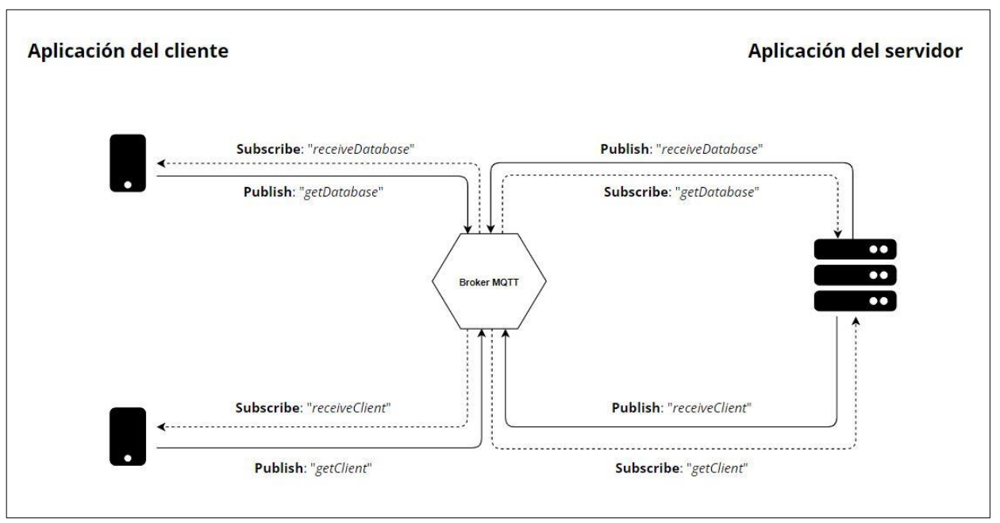
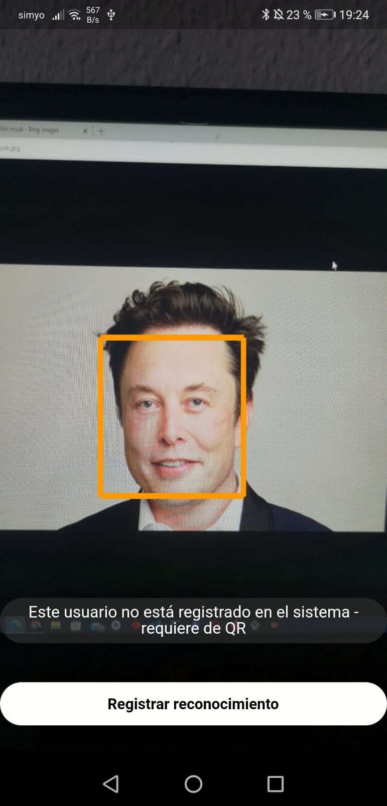
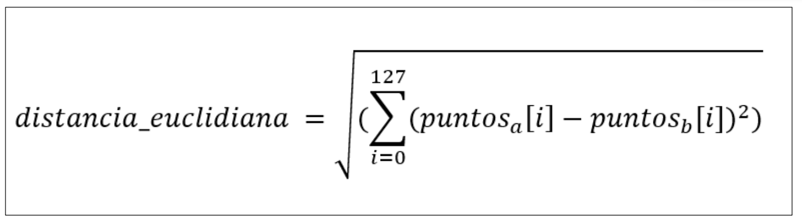
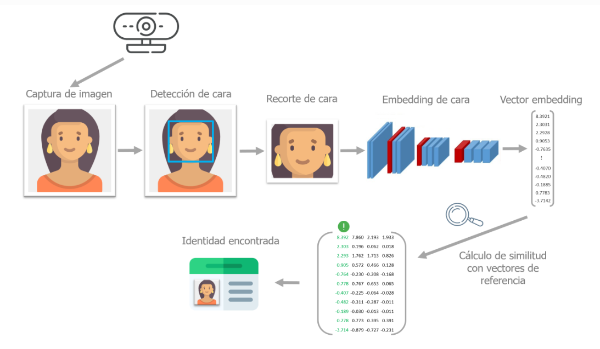
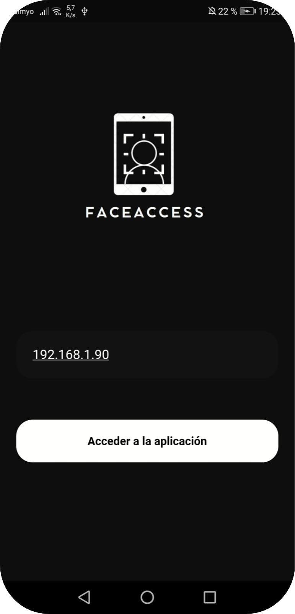
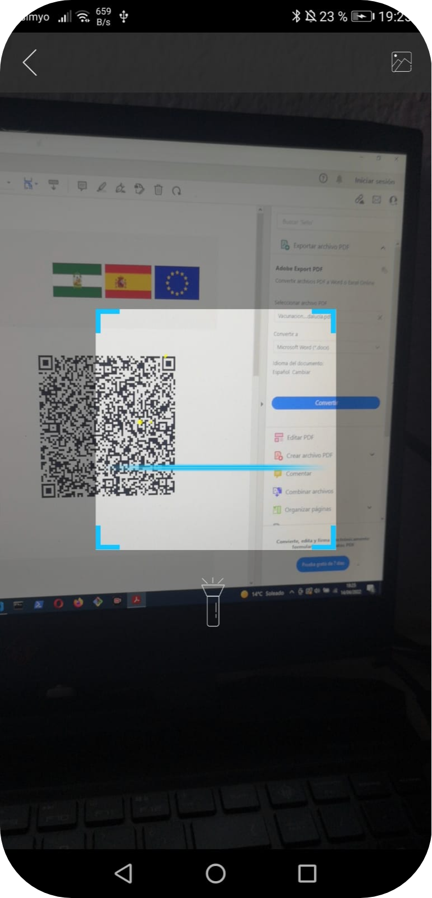
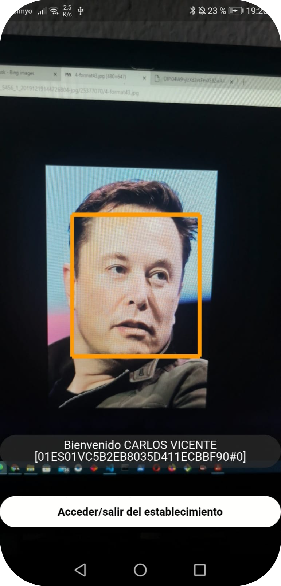

# FaceAccess Client

Esta es la implementación de la aplicación móvil del cliente, correspondiente al sistema **FaceAccess**. 

## *Implementación*

Para el desarrollo del proyecto se ha empleado el framework multiplataforma Flutter. Además de otras dependencias como **TensorFlow**.

La premisa de esta aplicación es que el cliente puede solicitar el acceso a cualquier establecimiento con el sistema **FaceAccess**, para ello debe realizarse una captura de su rostro, y mediante nuestros modelos de Deep Learning, poder identificar dicho cliente en todo momento.

En caso de que el cliente no esté registrado, el sistema le solicitará presentar su **Certificado COVID**. 

Si al cliente se le concede el acceso, esta aplicación enviará una señal al relé del servidor para abrir la puerta de forma automática.

La siguiente imagen representa la **comunicación entre esta aplicación y el servidor**.

<figure>
  
</figure>

En torno a la IA, se ha empleado un sistema de reconocimiento facial con TensorFlow que funciona a partir de tres fases:

### *Fase 1. Detección facial*

Este primer modelo toma la captura realizada por el cliente, le aplica un preprocesado y ejecuta el modelo con esta información. 

El resultado son las diferentes coordenadas donde se hallan rostros, esto nos servirá para recortar la foto original y obtener un **crop** del rostro.

<figure>
  
</figure>

### *Fase 2. Reconocimiento facial*

Una vez obtenido el crop del rostro, se le aplica otro preprocesado, y se ejecuta el segundo modelo. 

Obtenemos el vector embedding, que son las distancias de los diferentes puntos tomados respecto a la cámara. En el modelo utilizado se toman 128 puntos, por ello el vector resultante debe tener una dimensión de 128.

### *Fase 3. Identificación del reconocimiento obtenido*

La última fase del procedimiento consiste en tomar el vector de 128 puntos generado, y compararlos con el vector embedding de cada cliente registrado, almacenado en base de datos.

Para ello debemos calcular la distancia euclidiana:

<figure>
  
</figure>

En nuestro caso, si la distancia es inferior a 0.7, implica que los dos rostros tienen un parecido muy similar, por ello suponemos con esta información que la identificación se ha llevado a cabo con éxito.

<figure>
  
</figure>

## *Imágenes de la aplicación móvil*

<figure>
  
</figure>

<figure>
  
</figure>

<figure>
  
</figure>
